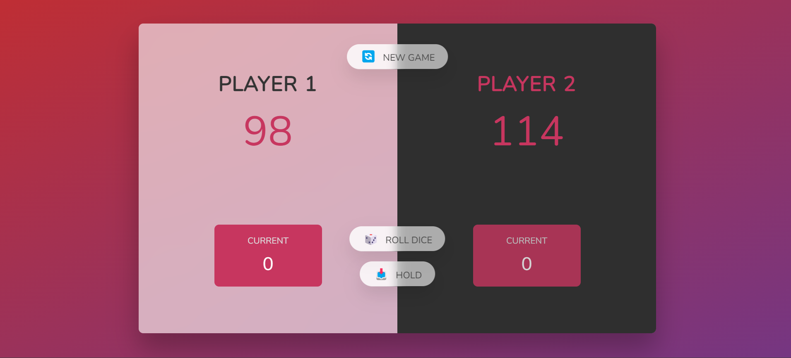

# Pig Game



## Game Overview

The **Pig Game** is a simple, fun, two-player game where both players take turns rolling a dice and trying to accumulate points. The goal is to be the first player to reach a total score of 100.

### Rules:

- Players take turns rolling a dice.
- Each dice roll adds its value to the player’s **current score** unless the dice lands on `0`.
- If a player rolls a `0`, they lose all points accumulated during that turn, and the turn switches to the next player.
- Players can choose to "Hold" their score at any time, which adds their **current score** to their **total score** and switches the turn to the other player.
- The first player to reach a **total score** of 100 wins the game.

## Features

- **Two-player mode**: Both players can take turns on the same device.
- **Dice Roll**: Simulated dice roll with random values between 0 and 6.
- **Hold Function**: Allows players to hold their score and pass the turn.
- **Winning Condition**: A player wins when they reach 100 points.

## Technologies Used

- **HTML**: Markup for the game layout.
- **CSS**: Basic styling for the game interface.
- **JavaScript**: Game logic and interactivity.

## Game Interface

- **Player 1 and Player 2 Sections**: Displays the total score and current score of each player.
- **Roll Dice Button**: Allows the current player to roll the dice.
- **Hold Button**: Allows the current player to hold their current score and pass the turn.
- **Dice Display**: Shows the result of the current dice roll.

## Installation & Setup

1. Clone the repository:
   ```bash
   git clone https://github.com/ghnsym/pig-game.git
   ```

2. Open the project directory:
   ```bash
   cd pig-game
   ```

3. Run the game:
   - Simply open the `index.html` file in your browser to start playing.


## License

This project is licensed under the MIT License. See the [LICENSE](LICENSE) file for details.
